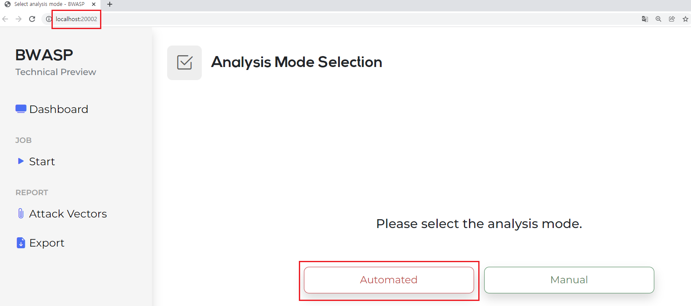
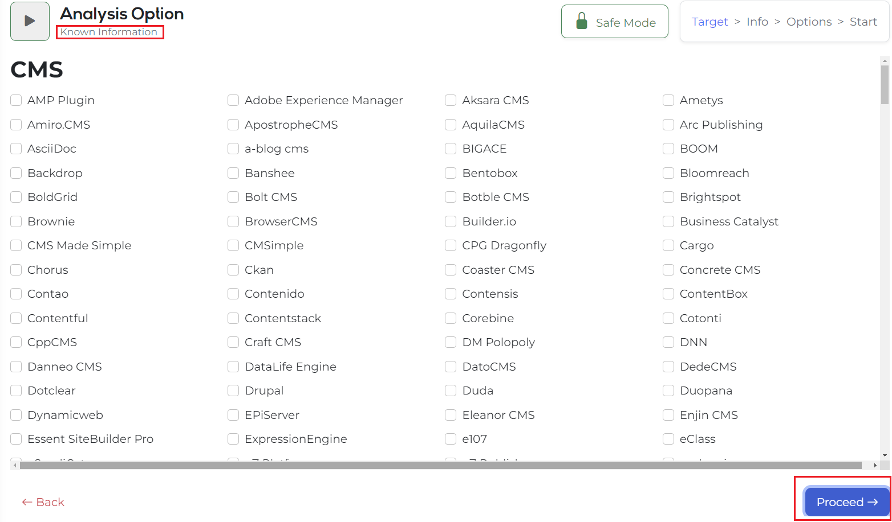
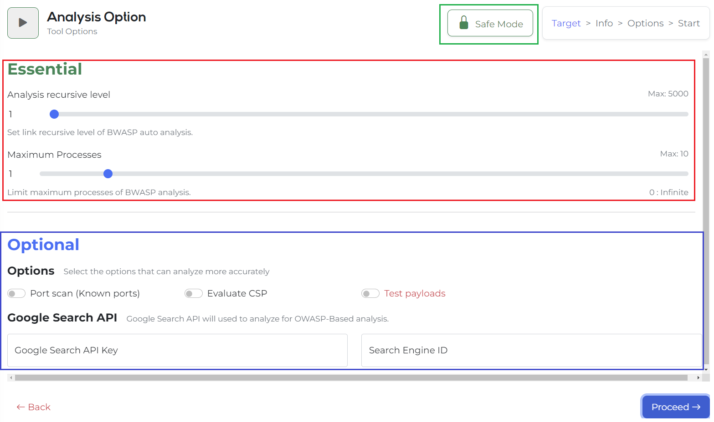
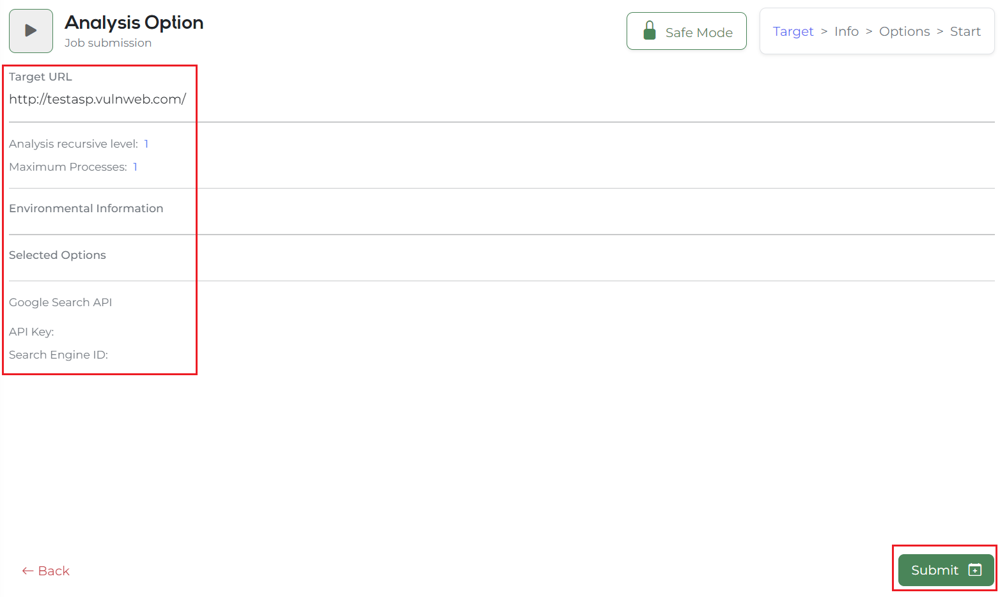
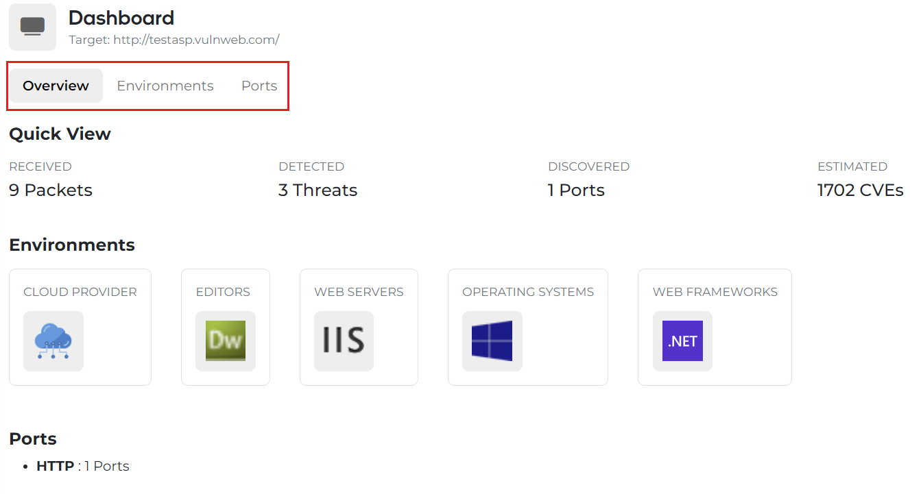
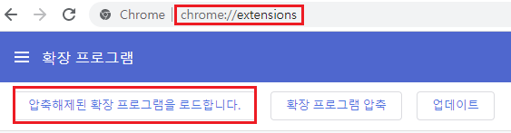
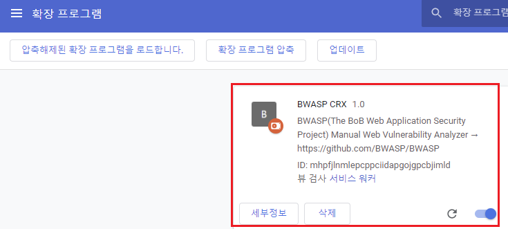
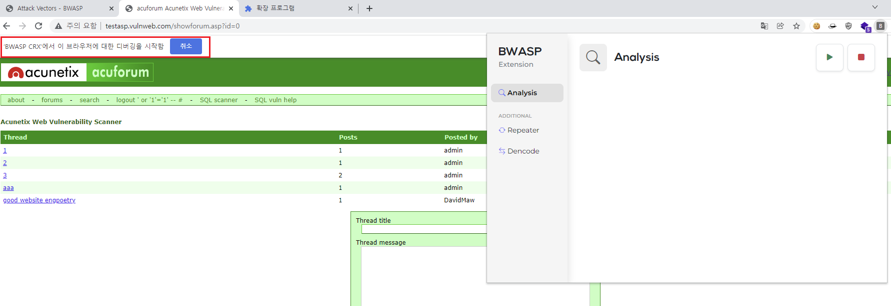
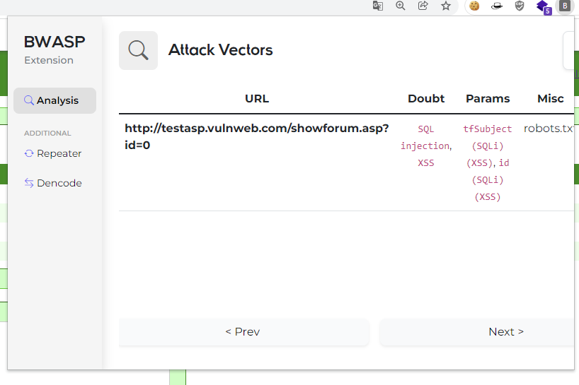
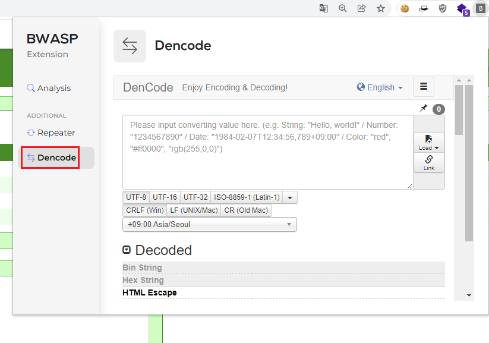

# BWASP Guide English ver.

## Automated analysis with Python

  

When accessing the URL (http://localhost:20002) for the first time as shown in Figure 1, you can see that there are two methods: Automated and Manual.

By clicking Automated, the automatic analysis function can be executed.

If you run the automatic analysis function in Figure 1, the target URL is testasp as shown in Figure 2, but enter the site you want to test and click the Process button.

Then, it is switched to a screen where you can input information you already know, and if you already know information, you can click on the corresponding environment and enter the version. (If you don't know the information in the target URL, click the Process button immediately.)

**[Essential]**

**Analysis recursive level** is an option to specify a crawling search level. Up to 5000 can be set. You can also directly modify the numerical value shown on the left.

**Maxim Processes** is an option to determine the number of multi-processes. The speed of analysis can be increased by designating this number. 1 to 10 are the basic parts that can be designated, and if 0 is designated, the number of multi-processes can be turned indefinitely.

**[Optional]**

Attack option -> Test payloads

The test payload is an option to proceed with the attack. Currently, only attacks in the form of checking only SQL injection errors are implemented. It is possible to check and proceed only when 'Unlock' is performed through the [Disable Risk Lock] button. (This tool aims to minimize availability infringement, reduce server load, and analyze, so the attack option is basically locked.)

- According to the current attack option, the results are registered in the DB and the pages that detect errors are divided, but the exposure in the guidelines is still under development, so we will update it as soon as it is corrected!

Port scan, CSP is basically there, and there is a Google Search API input column.

This is a function that helps you discover indexing information and admin pages through Google Search, and you can proceed only with Google Search API Key and Engine ID values.

    -> To sum up, if there is no corresponding value among the options above, click the Process button to move on.

If you move on, you will be turned into a page where you can check the final entered information. The summary of the information here is as follows.

1. Target URL.
2. Crawling search level.
3. Number of multi-processes.
4. Contents of entering web environment information that you already know.
5. Contents for selected options such as port scan, CSP, Test payloads, etc.
6. Google Search API Key and Engine ID values

After finally checking the above values, the automatic analysis function is performed immediately by clicking the Submit button!

When you press the Submit button in Figure 5, a real-time notification is output, and if you wait a little bit, it automatically switches to the Dashboard screen. Thereafter, web environment information, port information, and the number of CVEs to be imported in real time can be determined.

Here, you can check the URL information entered in Figure 6 again, and if you want to proceed with the analysis again with other information, you can return to Figure 2 by clicking the Start button on the left side and proceed with the analysis.

If you want to see the Attack Vector in real time in the middle of the process, click Attack Vector on the left side of Figure 7 to check the Attack Vector as shown in Figure 7. The added real-time data can be viewed continuously by UPDATE through the right setting icon in Figure 7.

And by clicking on each analyzed information record, detailed information can be checked modally.

In Modal, you can check the following information.

1. Basic information such as impact level seen in records and predicted vulnerability items.
2. Cookies
3. Query Strings
4. Input Tag
5. Main Information and Communication-based Guide
6. Cheat Sheet that you can refer to according to the vulnerability items.

In the case of the design, it is currently updated and can be checked more neatly than [Figure 9].

This screen that appears when you click the icon (sawwheel) is [Figure 9].

The paging function is currently implemented as above, and the basic paging function in the lower right is still being implemented.

The attack vector information added may be updated and viewed through the above function.

## Manual analysis with Chrome extension

As shown in [Figure 10], the BWASP Company Chrome Extension program is installed as a clone.

To register Chrome Extension, access chrome://extensions and press the load extension button.

Git to a chrome extensions folder.

Thereafter, the extended program loaded in [Figure 12] is activated.

Since the manual analysis function and the automatic analysis function must use the same DB for the same URL, the startup method must be automatically started to utilize the same DB.

As shown in Figure 14, the Manual button on the right is a button that will be used as a guide to install the Chrome Extension on the Chrome Web Store in the future.

A chromium extension program can be used to proceed with further analysis after going through procedures such as login and authentication. If you click the above button, you can see the following results.

If there is a debugging mark when it starts, it has proceeded normally. In order to receive information on the corresponding page, refresh F5 must be performed once after the start button.

And you can receive and check information through the Python Flask Attack Vector.

As for how to use the repeater, press the run button in the same way as Analysis and proceed with then proceed with refresh (F5).

In order to provide additional convenience functions, the Dencode site including Decode and Encode is provided in the form of an iframe.

Through the above site, additional problems related to encoding decoding can be quickly solved using the tool.

If you come back to the place where you used to collect attack vectors, you can also see the results of the chromium expansion program. If pressed, you can check the detailed analysis, such as the modal notation seen above.
