# BWASP 사용법 가이드

## 자동 분석 기능

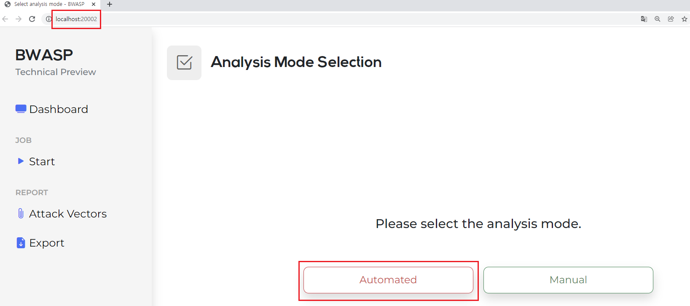

[그림 1]과 같이 처음 URL에 접근하면 Automated, Manual 두 방식이 있는 것을 볼 수 있다.
Automated를 클릭하면 자동 분석 기능을 실행할 수 있다.

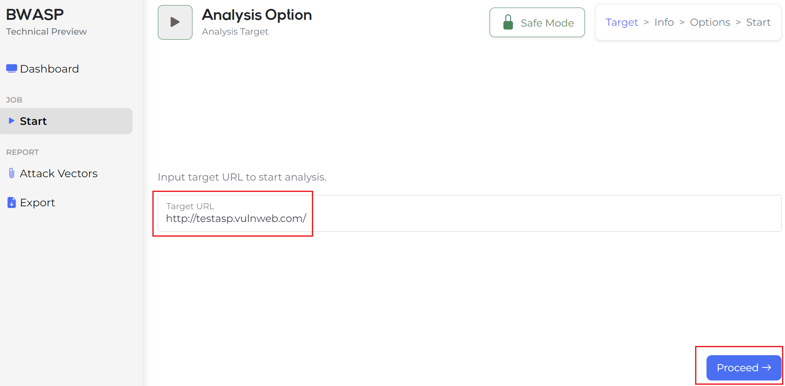

[그림 1]에서 자동 분석 기능을 실행하면 [그림 2]와 같이 대상 URL이 기본으로 testasp가 되어있는데 테스트하려는 사이트를 입력하고 Proceed 버튼을 클릭한다.

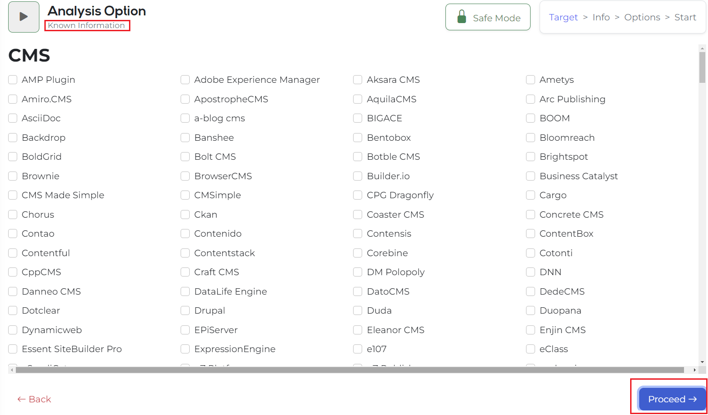

그러면 이미 알고 있는 정보를 입력할 수 있는 화면으로 전환되는데 이미 알고 있는 정보가 있다면 해당 환경을 클릭하고 버전도 입력할 수 있다. (대상 URL에 알고 있는 정보가 없다면 바로 Proceed 버튼을 클릭한다.)

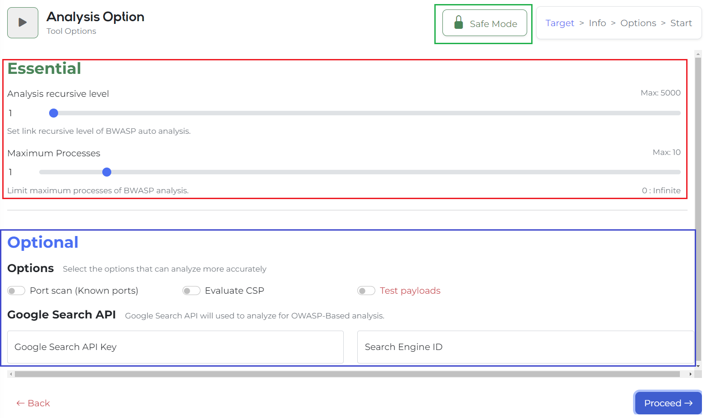

[Essential]

**Analysis recursive level**은 크롤링 탐색 레벨을 지정할 수 있는 옵션이다. 최대 5000까지 설정할 수 있다. 왼쪽에 보이는 숫자 값을 직접 수정할 수도 있다.

**Maximum Processes** 멀티 프로세스 개수를 정할 수 있는 옵션이다. 이 개수 지정에 따라 분석 속도를 높일 수 있다. 1부터 10까지가 기본으로 지정할 수 있는 부분이며 0으로 지정하면 멀티 프로세스 개수를 무한정으로 돌릴 수 있다.

[Optional]
공격 옵션 -> Test payloads
테스트 페이로드는 공격을 진행하는 옵션이다. 현재 SQL injection Error만 확인하는 형태의 공격만 진행되도록 구현되어 있다. [Disable Risk Lock] 버튼을 통해서 ‘Unlock’을 한 경우에만 체크하여 진행할 수 있다. (본 도구는 가용성 침해 최소화와 서버 부하를 줄이고 분석하는 것이 목적이므로 해당 공격 옵션에 대해서는 기본으로는 lock이 되어있는 상태다.)

-	현재 공격 옵션에 맞춰서 결과는 DB에 등록이 되어 Error를 탐지한 페이지가 구분이 되지만 가이드라인에서 노출되는 부분이 아직 개발 중인 상태라 추후 수정되면 바로 업데이트할 예정입니다!

포트 스캔, CSP가 기본적으로 있고 Google Search API 입력 칸이 있다.

여기는 Google 검색을 통한 indexing 정보와 admin 페이지를 발견할 수 있도록 도와주는 기능을 하는데 Google Seach API Key와 Engine ID 값을 넣어야 진행할 수 있다.

    	정리하자면 위 옵션 중에 해당하는 값이 없으면 없는 상태로 Proceed 버튼을 클릭하여 넘어가면 된다.

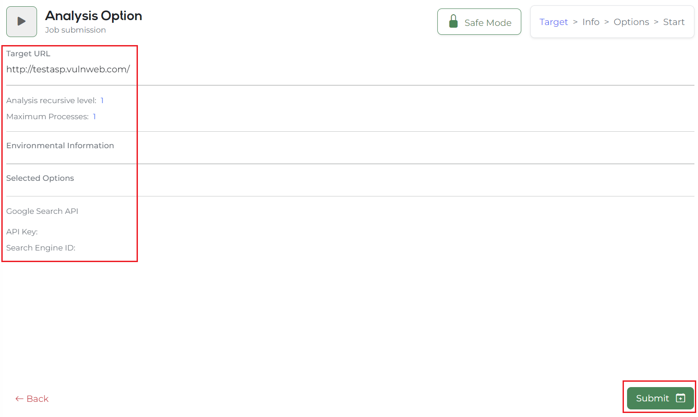

넘어가면 최종 입력된 정보를 확인할 수 있는 페이지로 전환된다. 여기 정보를 요약하면 아래와 같다.

1.	대상 URL
2.	크롤링 탐색 레벨
3.	멀티 프로세스 개수
4.	이미 알고 있는 웹 환경 정보를 입력한 경우에 대한 내용
5.	포트 스캔, CSP, Test payloads(공격 옵션) 등 선택한 옵션에 대한 내용
6.	Google Search API Key와 Engine ID 값

위 값들을 최종 확인 후 Submit 버튼을 클릭하면 바로 자동 분석 기능이 수행된다!

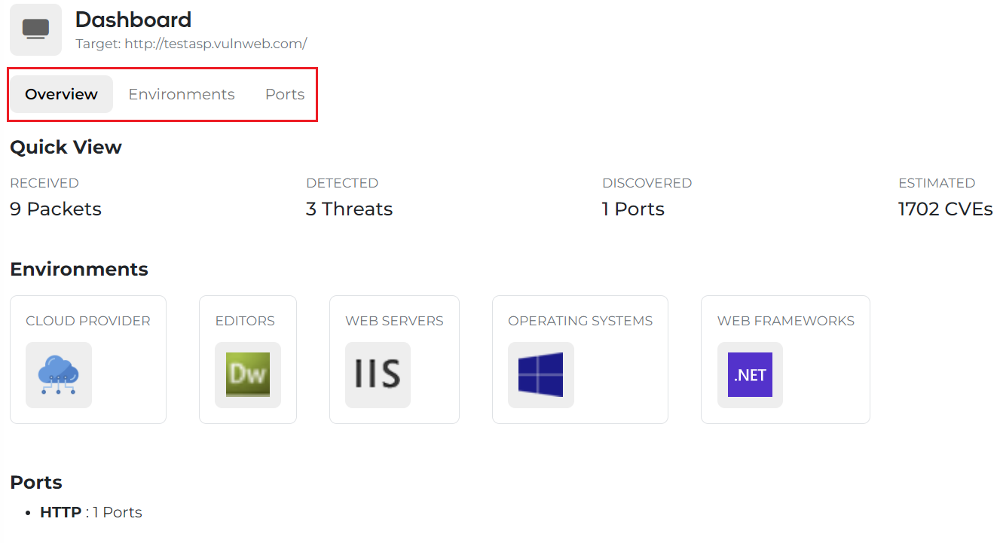

[그림 5]에서 Submit 버튼을 누르면 실시간 알림이 출력되고 조금만 기다리면 바로 자동으로 Dashboard 화면으로 전환된다. 이후 실시간으로 가져오는 웹 환경 정보와 포트 정보 그리고 CVE 개수를 파악할 수 있다.

여기서 [그림 6]에서 입력한 URL 정보를 다시 확인할 수 있으며 이후 다른 정보로 다시 분석을 진행하고 싶을 때는 왼쪽 사이드에 있는 Start 버튼을 클릭하여 [그림 2]로 돌아가서 분석을 진행할 수 있다.

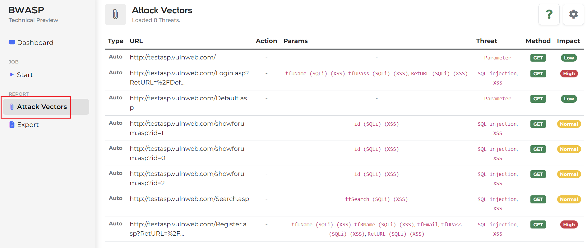

진행되는 중간에 Attack Vector를 실시간으로 보고 싶을 때 [그림 7]의 왼쪽 사이드에서 Attack Vectors를 클릭하면 [그림 7]과 같이 Attack Vector를 확인할 수 있다. 추가되는 실시간 데이터들은 [그림 7]에서 오른쪽 설정 아이콘을 통해 UPDATE를 하면 지속적으로 추가되는 데이터를 볼 수 있다.

그리고 각 분석된 정보 레코드를 클릭하면 자세한 정보를 모달로 확인할 수 있다.

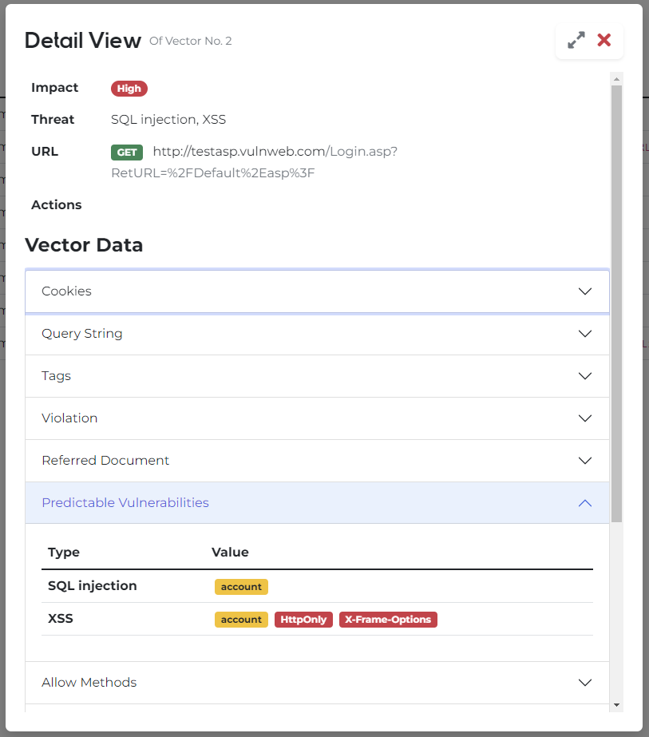

모달에서는 아래와 같은 정보를 확인할 수 있다.
1.	레코드에서 보던 영향도, 예측된 취약점 항목 등 기본 정보
2.	Cookies
3.	Query Strings
4.	Input Tag
5.	주요정보통신기반 가이드
6.	취약점 항목에 맞춰 참고할 수 있는 Cheat Sheet

디자인의 경우 현재 업데이트되어 [그림 9]보다 더 깔끔하게 확인할 수 있다.

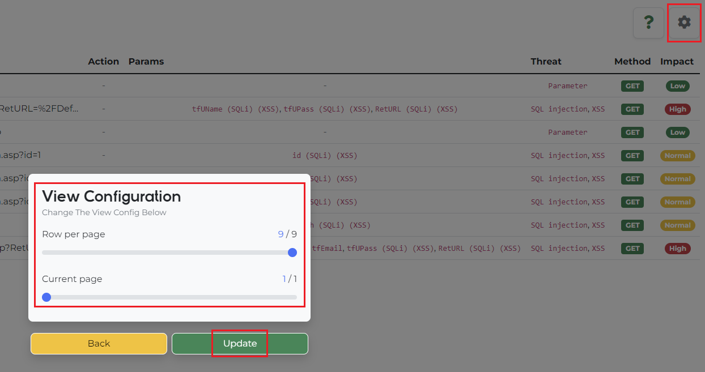

[그림 7]에서 말한 설정 아이콘(톱니바퀴)을 클릭하면 나오는 화면이 [그림 9]이다.

페이징 기능이 현재 위와 같이 구현되어 있고 오른쪽 아래에 있는 기본 페이징 기능은 아직 구현 중인 상태다.

위 기능을 통해 추가되는 공격 벡터 정보들을 업데이트하여 볼 수 있다.

## 수동 분석 기능

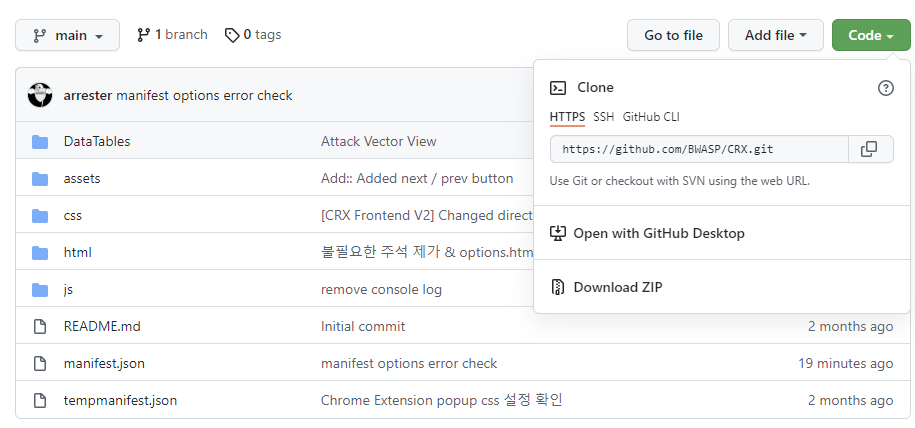

[그림 10]과 같이 BWASP Companion 크롬 확장 프로그램을 clone으로 설치한다.

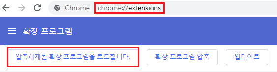

Chrome Extension을 등록하기 위해 chrome://extensions에 접근하여 확장 프로그램 로드 버튼을 누른다.

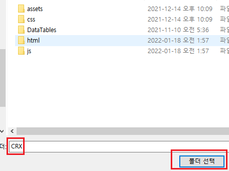

Git으로 받은 크롬 확장 프로그램 폴더를 선택한다.

이후 [그림 12]에서 로드된 확장 프로그램을 활성화한다.

수동 분석 기능과 자동 분석 기능이 같은 URL에 같은 DB를 사용해야 하기 때문에 시작 방식은 우선 자동으로 시작을 한 상태여야 수동도 같은 DB를 활용할 수 있다.

[그림 14]와 같이 오른쪽에 있는 Manual 버튼은 향후 Chrome Extension을 Chrome WebStore에 올려서 해당 링크로 설치할 수 있는 안내로 활용될 버튼이다.

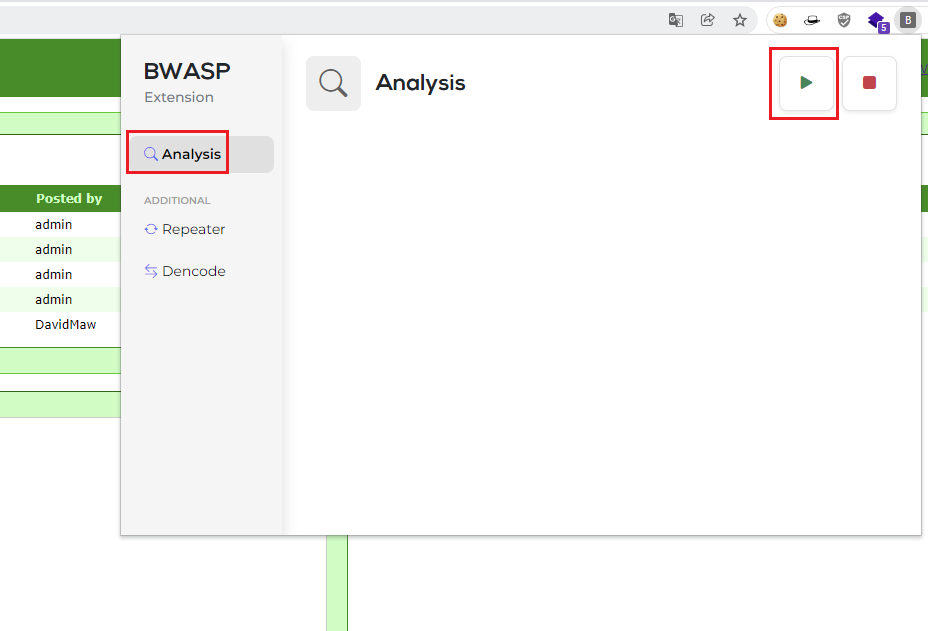

로그인, 인증 등 절차를 거친 후 추가 분석을 진행할 수 있도록 크롬 확장 프로그램을 이용할 수 있다. 위와 같은 버튼을 클릭하면 아래와 같은 결과를 볼 수 있다.

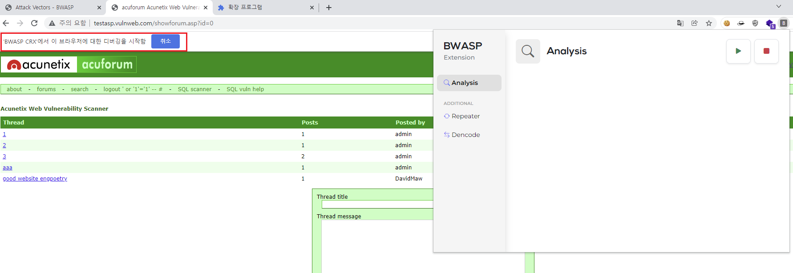

시작하면 디버깅 표시가 나온다면 정상적으로 진행된 것이다. 해당 페이지에 대한 정보를 받기 위해 시작 버튼 후 새로고침(F5)를 한 번 진행해야 한다.

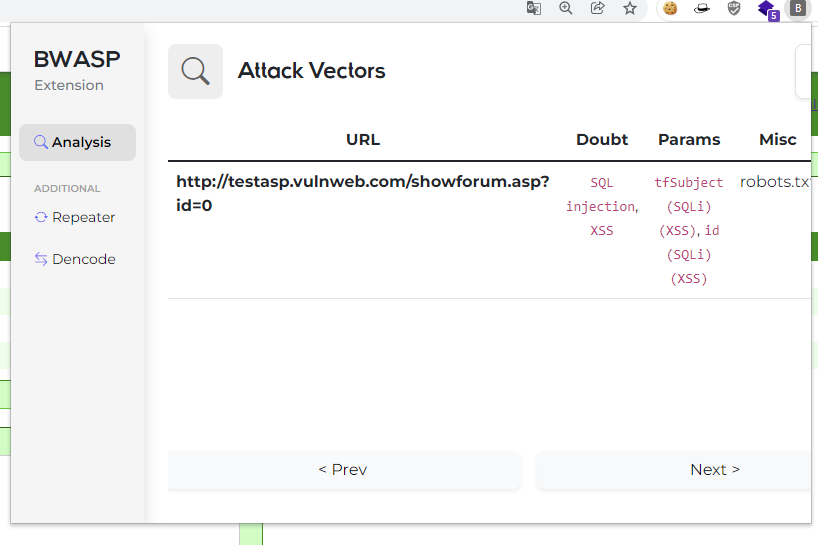

그리고 Python Flask Attack Vector를 거쳐서 정보를 전달받고 확인할 수 있다.

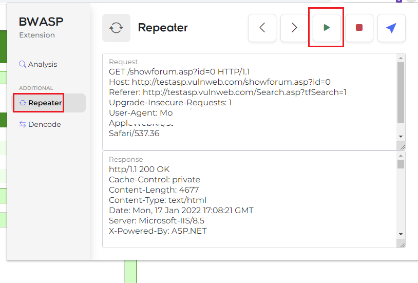

리피터 사용 방법도 Analysis와 동일하게 실행 버튼을 누른 뒤 새로고침(F5)를 진행하면 된다.

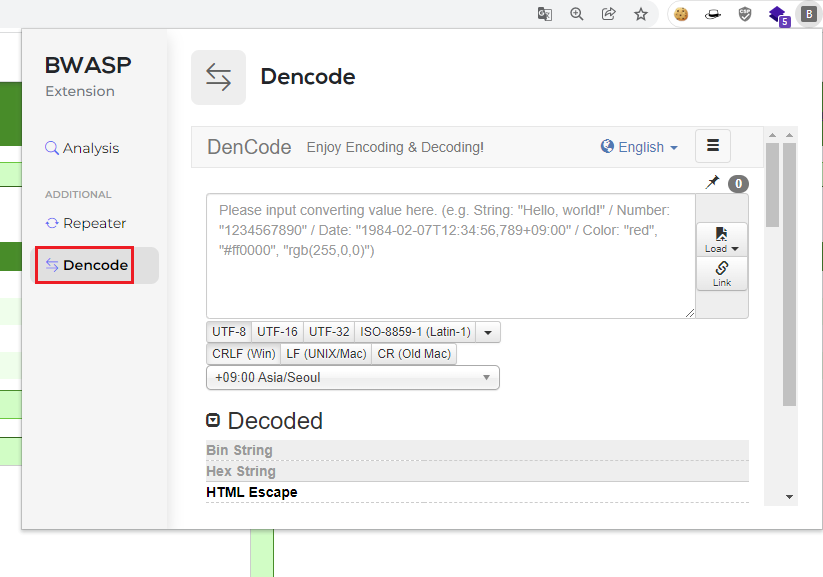

편의 기능을 추가로 제공하고자 Decode와 Encode가 포함된 Dencode 사이트를 iframe 형태로 제공한다.

위 사이트를 통해 추가로 인코딩 디코딩 관련 문제를 빠르게 해당 도구를 활용하여 해결할 수 있다.

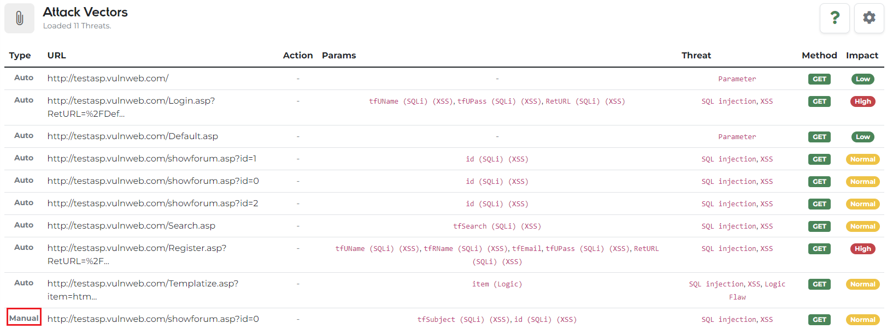

공격 벡터를 모아보던 곳으로 다시 오면 크롬 확장 프로그램으로 진행했던 결과들도 같이 볼 수 있다. 누르게 되면 위에서 보던 모달 표기와 같이 상세하게 분석된 내용을 확인할 수 있다.